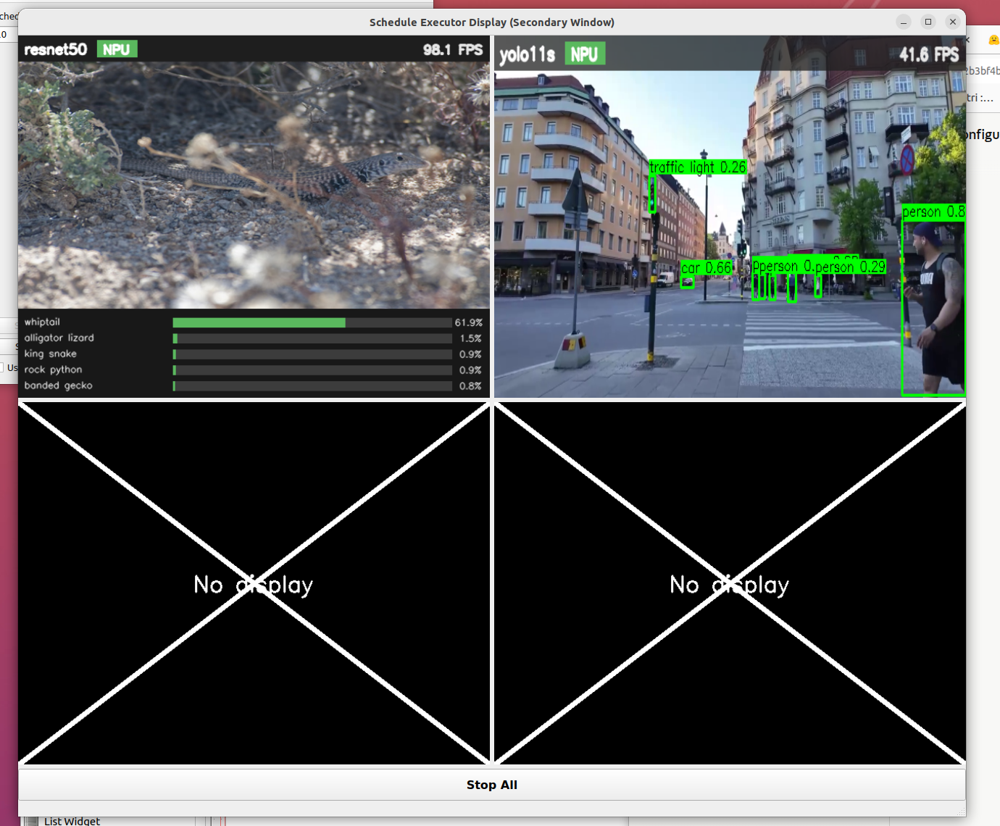
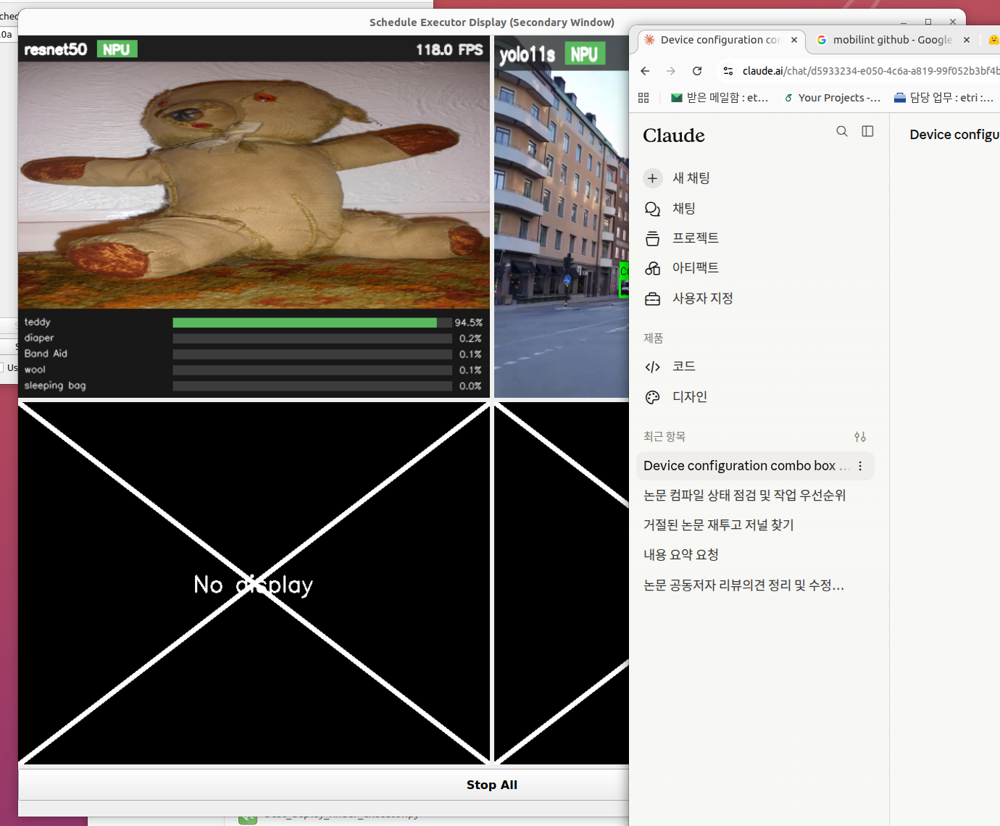

# 4창 고정 표시 + 15세트 CPU-NPU 디스플레이 순차 테스트 보고서

- 날짜: 2026-07-20
- 대상: `best_deploy_finder_executor.py`의 "Load Best Deployment and Start Execution"이
  띄우는 `schedule_executor_display.ui` 기반 실행 화면(`UnifiedViewer`).
- 판정: **✅ 15/15 세트 통과** — 항상 4창(2×2) 고정, 미사용 슬롯 X 표시, 엄격한 순차 실행.

---

## 0. 요약

| 항목 | 결과 |
|---|---|
| 그리드 배치 | **15/15 세트 실제 표시 = 예상 가시화** (4+0X ·5, 3+1X ·6, 2+2X ·4) |
| 핵심 케이스 (가시화 2개) | **2창 + 2 X** 확인 (세트 11·12·13·15, 스크린샷 포함) |
| 검은 빈칸 | **0건** — 비활성 슬롯 전부 X + "No display" |
| Predict/OOD | 15/15 predict OK, **OOD 경고 0건** |
| 순차성 | **겹침 위반 0건** (직전 종료 < 다음 시작, 항상) |
| 자원 정리 | **좀비/고아 0건**, 매 세트 NPU 모델 dispose 확인 |

---

## 1. 4창 고정 표시

### 1.1 `schedule_executor_display.ui`의 원래 슬롯 수
`.ui`는 **원래부터 4개 뷰 슬롯**(`view1`~`view4`, 각 `QLabel` 640×480)을
`QGridLayout name="videoLayout"`에 **2×2**(row0/col0·col1, row1/col0·col1)로 갖는다.
즉 "기본 설정 그대로 4개"는 `.ui`의 실제 레이아웃과 일치한다.

### 1.2 4슬롯이 비어 보이던 원인과 수정
- **원인**: `unified_viewer.py:_layout_visible_views()`가 그리드를 **실제 가시화 수 M에
  맞춰 리플로우**했다 (`cols = 1 if len(used)<=1 else 2`). M=2이면 1×2가 되어 X 없이 두 칸만
  나오고 나머지는 사라져 "화면이 비어 보임".
- **수정**: 그리드를 **항상 2×2 고정**으로 배치하고, `DISPLAY_SLOTS`(4개)를 순회하며
  - 앞의 M개(=화이트리스트 교집합) → 라이브 타일(프레임은 `display_slot_of` 라우팅으로 도착)
  - 나머지 4−M개 → **X 플레이스홀더**(`create_x_image(label="No display")`)
  로 **항상 채운다**. 리플로우 제거. M=0이면 4칸 전부 X + 사유 로그.
- 화이트리스트는 **단일 상수** `unified_viewer.VISUALIZABLE_MODELS =
  {qwen2_vl, resnet50, yolo11s, llama1b}` 한 곳에서만 정의 (테스트도 이 상수를 임포트).
- 각 뷰는 가시화 여부와 무관하게 **전부 실행·측정**된다 (렌더링 결정일 뿐, 스케줄에서 빼지 않음).

### 1.3 방어 처리
- **M > 4**: 화이트리스트가 4개라 실무상 없지만, 초과 시 앞 4개만 표시하고 로그 경고.
- **M = 0**: 4슬롯 전부 X + "No visualizable models in this deployment … Whitelist: …" 로그.
  실행·측정은 정상 진행.

---

## 2. X 표시 렌더링 (스크린샷)

비활성 슬롯은 검은 빈칸이 아니라 **큰 흰 X + "No display"** 라벨(테두리 유지, 2×2 형태 인지 가능).

**세트 15 (`resnet50, yolo11s`) — 가시화 2개 → 2창 + 2 X (핵심 요구):**

- 좌상 `resnet50 [NPU]` 98.1 FPS (분류 바), 우상 `yolo11s [NPU]` 41.6 FPS (검출 박스)
- 좌하·우하 **X + "No display"**

**세트 11 (`mobilenet_v2, resnet50, yolo11l/m/n/s/x`, 7모델 vision-only) — 역시 2창 + 2 X:**

- 실행 모델 7개지만 화이트리스트 교집합은 `{resnet50, yolo11s}` 2개 → 2 타일 + 2 X.
  (나머지 mobilenet_v2·yolo11l/m/n/x는 화면 없이 실행·측정만.)

---

## 3. 15세트 테스트 결과표 (CPU-NPU, deploy_cpu_npu, 각 ~20초)

| 세트 | 실행 모델수 | 예상 가시화 | 실제 표시 | X 슬롯 | Predict OK | 실행 OK | 20s 완료 | exit | 잔존 |
|---:|---:|---:|---:|---:|:--:|:--:|:--:|---:|---:|
| 1  | 7 | 4 | 4 | 0 | ✓ | ✓ | ✓ | 0 | 0 |
| 2  | 8 | 4 | 4 | 0 | ✓ | ✓ | ✓ | 0 | 0 |
| 3  | 6 | 4 | 4 | 0 | ✓ | ✓ | ✓ | 0 | 0 |
| 4  | 5 | 4 | 4 | 0 | ✓ | ✓ | ✓ | 0 | 0 |
| 5  | 4 | 3 | 3 | 1 | ✓ | ✓ | ✓ | −9† | 0 |
| 6  | 4 | 3 | 3 | 1 | ✓ | ✓ | ✓ | 0 | 0 |
| 7  | 4 | 3 | 3 | 1 | ✓ | ✓ | ✓ | 0 | 0 |
| 8  | 4 | 4 | 4 | 0 | ✓ | ✓ | ✓ | −9† | 0 |
| 9  | 4 | 3 | 3 | 1 | ✓ | ✓ | ✓ | −9† | 0 |
| 10 | 3 | 3 | 3 | 1 | ✓ | ✓ | ✓ | 0 | 0 |
| 11 | 7 | 2 | 2 | 2 | ✓ | ✓ | ✓ | 0 | 0 |
| 12 | 5 | 2 | 2 | 2 | ✓ | ✓ | ✓ | −9† | 0 |
| 13 | 3 | 2 | 2 | 2 | ✓ | ✓ | ✓ | 0 | 0 |
| 14 | 3 | 3 | 3 | 1 | ✓ | ✓ | ✓ | −9† | 0 |
| 15 | 2 | 2 | 2 | 2 | ✓ | ✓ | ✓ | 0 | 0 |

**실제 표시 = 예상 가시화, 15/15 전부 일치. OOD 경고 0건. 좀비 0건.**

† exit −9 (5개 세트): graceful SIGTERM이 `TERM_WAIT`(20초) 내 프로세스 자체 종료까지
가지 못해 SIGKILL 백스톱으로 수거된 경우. **단, 5개 모두 종료 전에 NPU 모델을 전부
dispose**했다 (§5). 즉 −9는 “정리 실패”가 아니라 dispose 완료 후 잔류(torch/Mobilint
non-daemon 스레드) 프로세스를 강제 수거한 것 — 자원은 정상 반납, 좀비 0.

---

## 3-bis. 세트 간 순차성 증거 (겹침 0건)

각 세트의 실행 창 시작/종료 시각(HH:MM:SS.mmm)과 다음 세트 시작까지의 공백:

| 세트 | 시작 | 종료 | exit | 종료후 잔존 | 다음 시작까지 공백(s) |
|---:|---|---|---:|---:|---:|
| 1  | 10:38:45.421 | 10:39:08.779 | 0 | 0 | 12.3 |
| 2  | 10:39:21.077 | 10:39:43.890 | 0 | 0 | 6.1 |
| 3  | 10:39:50.039 | 10:40:11.189 | 0 | 0 | 5.0 |
| 4  | 10:40:16.212 | 10:40:38.679 | 0 | 0 | 4.5 |
| 5  | 10:40:43.168 | 10:41:23.213 | −9 | 0 | 4.5 |
| 6  | 10:41:27.761 | 10:41:50.411 | 0 | 0 | 4.5 |
| 7  | 10:41:54.949 | 10:42:18.261 | 0 | 0 | 4.6 |
| 8  | 10:42:22.827 | 10:43:02.868 | −9 | 0 | 4.5 |
| 9  | 10:43:07.387 | 10:43:47.432 | −9 | 0 | 4.6 |
| 10 | 10:43:52.016 | 10:44:12.106 | 0 | 0 | 10.5 |
| 11 | 10:44:22.564 | 10:44:44.291 | 0 | 0 | 5.6 |
| 12 | 10:44:49.922 | 10:45:29.967 | −9 | 0 | 4.4 |
| 13 | 10:45:34.398 | 10:45:55.944 | 0 | 0 | 4.4 |
| 14 | 10:46:00.344 | 10:46:40.381 | −9 | 0 | 4.2 |
| 15 | 10:46:44.627 | 10:47:06.222 | 0 | 0 | — |

- **모든 i에 대해 `종료(i) < 시작(i+1)` (겹침 위반 0건).** 종료와 다음 시작 사이에는
  항상 최소 ~4초 이상의 공백(안정화 대기 + 다음 세트 모델 로드)이 있다.
- 두 세트가 동시에/겹쳐 실행된 구간은 없다. 한 세트를 완전히 종료·검증한 뒤에만 다음을 시작.

---

## 4. 핵심 요구 — 가시화 2개 세트에서 2창 + 2 X

가시화 대상이 정확히 2개인 세트 **11·12·13·15**에서 모두 **실제 표시=2, X 슬롯=2**로
확인 (표 §3, 스크린샷 §2). 리플로우로 1×2가 되어 X가 사라지던 기존 버그가 해소되어,
항상 2×2 그리드에 2 타일 + 2 X가 유지된다.

---

## 5. 세트 간 자원 정리 (좀비/누수 없음)

- **매 세트 종료 시 실행 subprocess의 그룹 잔존 프로세스 수 = 0** (표 §3-bis "종료후 잔존").
- **전역 `schedule_executor_main.py` 프로세스도 세트 사이에서 0** (stray_before/after 전부 0).
- **NPU 모델 dispose 확인** — 종료 로그에서 `[Main] Signal 15 received; shutting down cleanly`
  → `Model disposed` (모델 수만큼) → `Throughput data saved`:

  | 세트(−9) | SIGTERM 처리 | dispose된 모델 수 | throughput 저장 |
  |---:|:--:|---:|:--:|
  | 5  | ✓ | 4 | ✓ |
  | 8  | ✓ | 4 | ✓ |
  | 9  | ✓ | 4 | ✓ |
  | 12 | ✓ | 5 | ✓ |
  | 14 | ✓ | 4 | ✓ |

  exit −9 세트조차 **모델을 전부 dispose한 뒤** 프로세스가 수거되었다. dispose를 건너뛴
  세트는 없다. 후속 세트가 매번 정상 로드된 것도 NPU가 실제로 반납됐다는 증거다.
- 종료 확인(잔존 0) 후 **2~3초 안정화 대기**를 거쳐 다음 세트를 시작 (요구 2.2.2).

---

## 6. 실패 세트

**없음.** 15/15 세트가 predict → 스케줄 생성 → 실행 화면(4창 고정 + X) → 20초 실행 →
정상 정리까지 에러 없이 완료. (테스트는 실패 세트도 정리를 강제하도록 작성했으나 발동되지 않음.)

---

## 부록 — 변경/산출물

- 코드: `unified_viewer.py` `_layout_visible_views()` (2×2 고정 + X), `utils.py`
  `create_x_image(label=...)` (라벨 파라미터 추가; 비활성 슬롯은 "No display").
- 테스트: `test_all_sets_display.py` (+ `test_all_sets_display.sh`) — 엄격 순차,
  실패도 정리, 화이트리스트 단일 상수 재사용, grid 라인 파싱으로 실제 표시 수 검증.
- 결과 원본: `<scratchpad>/display_test/results.json`, 세트별 `setNN.log`.
- 스크린샷: `docs/display_test/shot_set15_crop.png`, `shot_set11_crop.png`.
